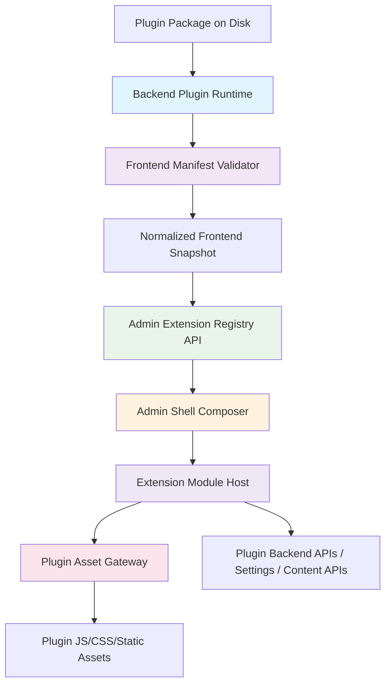

# Architectural Blueprint

## 1. Core Objective

在保留 CyCMS 现有后端插件运行时、权限模型和内容模型的前提下，引入一套生产可用的后台前端扩展平台，使启用后的插件能够把菜单、后台页面、编辑器扩展点、自定义字段渲染器和设置入口按权限注入官方前端，同时保证路由边界清晰、插件资产可控、故障可隔离、缓存可管理、升级可回滚。

## 2. System Scope and Boundaries

### In Scope

- 为插件定义生产级前端扩展契约，包括插件前端 manifest、路由、菜单、扩展点、字段渲染器和设置贡献。
- 在插件安装、升级、启用链路中校验前端资产、摘要、兼容性和冲突。
- 提供面向后台前端的插件扩展 bootstrap API、诊断 API 和插件静态资产网关。
- 在官方后台前端中实现动态菜单、插件页面挂载、扩展点挂载、自定义字段渲染器和插件设置集成。
- 提供安全与运维控制，包括同源资产策略、CSP、错误边界、诊断、遥测和版本兼容控制。

### Out of Scope

- 不设计公共站点页面注入或前台主题插件系统。
- 不设计跨域第三方 CDN 远程插件脚本加载。
- 不设计零信任插件沙箱或插件市场签名分发平台。
- 不设计原生移动端、桌面客户端或多前端壳共享一套插件 UI 运行时。
- 不把插件 UI 直接定义为共享 React 组件 ABI；插件与宿主之间使用宿主控制的挂载协议，而不是共享框架内部对象。

## 3. Core System Components

| Component Name | Single Responsibility |
|---|---|
| **Backend Plugin Runtime** | 负责插件安装、升级、启停、状态持久化，以及在生命周期变化时触发前端扩展元数据的校验与缓存失效。 |
| **Frontend Manifest Validator** | 负责读取插件前端 manifest、验证 schema/版本/摘要/冲突，并产出规范化的前端贡献快照。 |
| **Admin Extension Registry API** | 负责按用户权限、功能兼容性和插件状态输出后台前端 bootstrap 文档与诊断信息。 |
| **Plugin Asset Gateway** | 负责以同源、不可变、白名单方式暴露插件前端 JS/CSS/静态资源。 |
| **Admin Shell Composer** | 负责在官方后台前端中加载 bootstrap、生成菜单、解析插件路由命名空间、协调设置页与扩展点。 |
| **Extension Module Host** | 负责按统一 mount/unmount 协议加载插件页面、挂件和字段渲染器，并做故障隔离、上下文注入和生命周期管理。 |

## 4. High-Level Data Flow

## 5. Key Integration Points

- **Backend Plugin Runtime ↔ Frontend Manifest Validator**: 插件安装、升级、启用期间读取插件磁盘目录中的 `plugin.toml` 与前端 manifest，完成规范化与冲突校验。
- **Frontend Manifest Validator ↔ Admin Extension Registry API**: 通过规范化前端贡献快照和 revision token 共享启用插件的路由、菜单、扩展点和资产声明。
- **Admin Extension Registry API ↔ Admin Shell Composer**: 通过受保护的 bootstrap JSON 输出当前用户可见的插件贡献与诊断信息。
- **Admin Shell Composer ↔ Plugin Asset Gateway**: 通过同源 URL 加载插件 ESM 模块、样式和静态资源，并使用缓存头/版本号控制更新。
- **Admin Shell Composer ↔ Extension Module Host**: 通过统一的 page/widget/field renderer 合约把宿主上下文传给插件并收集异常与遥测。
- **Extension Module Host ↔ Plugin Backend APIs**: 插件页面通过宿主 SDK 使用认证过的 API client、settings/content helpers、导航与主题上下文。
- **Authentication**: 继续沿用现有后台认证与权限模型，前端 bootstrap 只做可见性过滤，真正授权仍由后端 API 判定。
- **Data Format**: 插件前端 manifest、bootstrap payload、诊断结果与 SDK 上下文均使用 JSON/TypeScript 合约表达。
