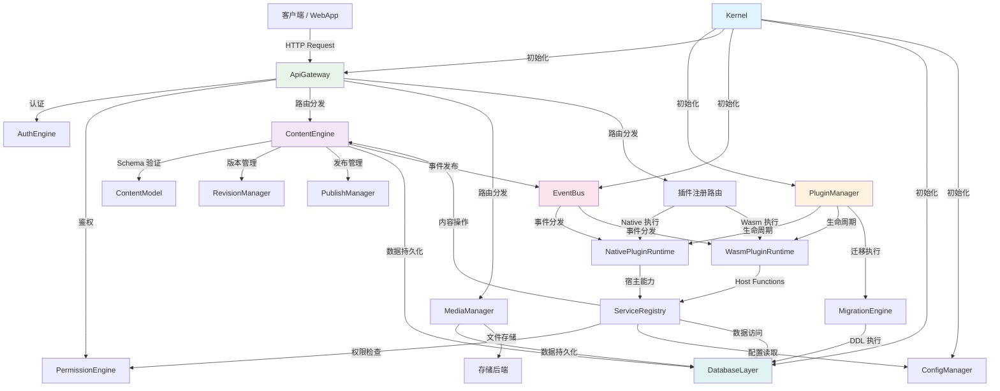

# Architectural Blueprint — cycms v0.1

## 1. Core Objective

cycms 是一个以 Rust 为内核、以插件生态为核心竞争力的现代化 Headless CMS 框架。目标是提供一个标准 CMS 内核（用户、权限、内容模型、CRUD、媒体、版本管理），同时从第一天起按插件平台架构设计，通过 Native + Wasm 双层插件体系支持无限功能扩展。所有 API 完全开放，官方 React Web 应用作为参考实现，在同一前端工程中同时覆盖后台管理域与访客站点域。成功标志：内核稳定可演进、插件接口强大且一致、官方实现不绑死系统、能跑通从内容模型定义到后台运营再到公开内容交付的完整链路。

## 2. System Scope and Boundaries

### In Scope

- 用户认证与会话管理（JWT / Session）
- RBAC + 资源级权限模型
- 动态内容类型构建器（Content Type Builder）
- 内容 CRUD 引擎（创建/读取/更新/删除/查询/筛选/排序/分页）
- 草稿/发布状态机与版本历史管理
- 媒体库（文件上传/存储/元数据/变体）
- REST API 自动生成与 OpenAPI 3.1 文档
- 事件总线（同步/异步事件发布与订阅）
- Native Rust 插件运行时（子 crate 插件加载与管理）
- Wasm 插件运行时（wasmtime 嵌入、Component Model 接口）
- 插件生命周期管理（安装/启用/禁用/升级/卸载）
- 插件依赖解析与服务注册表
- 插件 Manifest 规范（TOML 格式，含版本兼容性/权限/依赖声明）
- 系统设置与配置管理
- 数据库迁移系统
- 结构化日志与可观测性（tracing）
- CLI 工具（项目初始化、插件脚手架、迁移管理）
- React 官方 Web 应用（同一工程承载 `/admin` 管理域与 `/` 访客域）
- 公开内容站点与会员基础能力（首页、列表、详情、栏目/分类、搜索、登录/注册/个人中心）
- 多数据库支持（PostgreSQL 一级支持，MySQL/SQLite 兼容支持）

### Out of Scope

- SaaS 多租户架构
- 审核工作流（由插件实现）
- 评论系统（由插件实现）
- 高级 SEO / 站点优化（如 sitemap、robots.txt、canonical、noindex，由插件实现）
- 国际化/多语言（由插件实现，但内核预留扩展点）
- 全文搜索引擎（由插件实现）
- GraphQL 接口（由官方插件实现）
- 页面搭建器 / 可视化编辑器
- 邮件发送服务
- 第三方登录 / OAuth Provider
- 实时通信 / WebSocket 推送
- 会员高级账户流程（邮箱验证、忘记密码、密码重置）
- CDN / 边缘计算集成

## 3. Core System Components

| Component Name | Single Responsibility |
|---|---|
| **Core** | 公共类型、公共 trait、统一错误与 Result 别名，供所有 crate 依赖（对应 `cycms-core` crate） |
| **Kernel** | 应用启动引导、服务注册中心、生命周期管理、依赖图构建、运行时上下文提供 |
| **AuthEngine** | 用户认证（登录/注册/Token 刷新）、密码哈希、会话管理、认证中间件 |
| **PermissionEngine** | RBAC 角色/权限定义、资源级权限检查、权限中间件、插件权限注册 |
| **ContentModel** | 内容类型（Content Type）定义与管理、字段类型注册、Schema 验证规则、模型元数据存储 |
| **ContentEngine** | 内容实例 CRUD、查询/筛选/排序/分页、字段验证执行、内容状态管理 |
| **RevisionManager** | 版本快照创建与存储、版本历史查询、版本比较、版本回滚 |
| **PublishManager** | 草稿/发布状态机、发布/撤回操作、发布版本绑定 |
| **MediaManager** | 文件上传/下载、存储后端抽象、媒体元数据管理、文件变体生成 |
| **ApiGateway** | REST 路由注册与分发、请求/响应处理、中间件链 |
| **OpenApiAggregator** | 系统路由与插件路由的 OpenAPI 3.1 文档聚合与对外暴露（对应 `cycms-openapi` crate） |
| **EventBus** | 事件定义/发布/订阅、同步与异步事件分发、事件处理器注册 |
| **PluginManager** | 插件发现/安装/启用/禁用/升级/卸载、Manifest 解析、依赖解析与排序、插件设置管理 |
| **NativePluginRuntime** | Native Rust 插件加载与执行、trait 对象调度、宿主能力注入 |
| **WasmPluginRuntime** | wasmtime Engine/Store 管理、Wasm Component 编译/实例化、Host Function 绑定（与 Native 同权，不做沙箱或资源限制约束） |
| **ServiceRegistry** | 插件间服务发现与调用、typed contract 注册/查询、capability lookup |
| **DatabaseLayer** | 数据库连接池管理、多数据库抽象（PG/MySQL/SQLite）、查询构建辅助、JSONB 操作封装 |
| **MigrationEngine** | Schema 迁移执行（系统迁移 + 插件迁移）、迁移版本追踪、回滚支持 |
| **ConfigManager** | 系统配置加载（文件/环境变量）、运行时配置读写、插件配置命名空间隔离 |
| **SettingsManager** | 持久化系统设置存储/读取、插件设置 Schema 注册与管理 |
| **Observability** | 结构化日志集成（tracing）、请求追踪、审计日志记录 |
| **CLI** | 项目初始化（`cycms new`）、插件脚手架（`cycms plugin new`）、迁移命令、开发服务器启动 |
| **WebApp** | 统一 React Web 应用：单一工程承载 `/admin` 管理域与 `/` 访客域，提供后台运营、公开内容浏览与会员基础账户能力 |

## 4. High-Level Data Flow

## 5. Key Integration Points

- **Client ↔ ApiGateway**: HTTP/HTTPS REST API，JSON 请求/响应，Bearer Token 认证
- **ApiGateway ↔ AuthEngine**: 中间件调用链，从请求头提取 Token 并验证，返回用户身份上下文
- **ApiGateway ↔ PermissionEngine**: 中间件调用链，基于路由元数据和用户角色进行权限检查
- **ApiGateway ↔ ContentEngine**: 内部 Rust 函数调用，经 axum Router 分发到 handler
- **ApiGateway ↔ 插件路由**: 插件通过 ServiceRegistry 注册路由，ApiGateway 合并到总路由表
- **ContentEngine ↔ DatabaseLayer**: 通过 sqlx 连接池执行 SQL 查询，使用 JSONB 存储内容字段
- **ContentEngine ↔ EventBus**: 内容 CRUD 操作后发布对应事件（content.created/updated/published 等）
- **EventBus ↔ PluginRuntime**: 事件异步分发到已订阅的 Native/Wasm 插件处理器
- **WasmPluginRuntime ↔ ServiceRegistry**: 通过 wasmtime Host Functions 将宿主能力注入 Wasm 实例
- **NativePluginRuntime ↔ ServiceRegistry**: 通过 trait 对象和 Arc 指针直接调用宿主能力
- **PluginManager ↔ MigrationEngine**: 插件安装/升级时执行插件声明的数据库迁移
- **WebApp ↔ ApiGateway**: 前端通过 HTTP 调用后端 REST API；管理域使用 Bearer Token，访客会员域使用成员会话
- **数据格式**: 所有组件间通信统一使用 JSON（serde_json），内部使用强类型 Rust struct
- **OpenAPI**: utoipa 在编译期收集路由元数据，运行时合并插件路由文档，通过 `/api/docs` 提供
